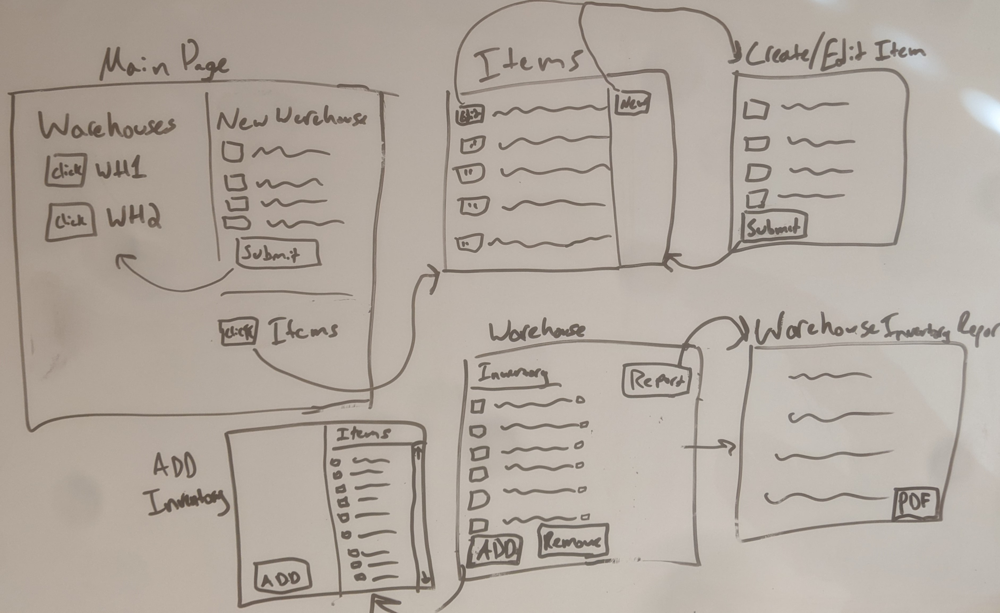

# Design Document

## PopStock Design

## 1. Problem Statement

A new warehouse can be difficult to spin up, requiring you to make difficult decisions about what items you are going to stock. PopStock will solve this problem by using data to choose the most profitable items to stock, based on metrics such as margin, time-to-replenish, sales volume, item synergy, and region adjusted shipping costs.  PopStock allows business owners to make logistics focused, data driven decisions about what products would be most lucrative.

## 2. Use Cases

U1. As a PopStock customer, I want to create new items with attributes and metrics that can be used to stock warehouses

U2. As a PopStock customer, I want to create a new warehouse with a name and a regional location

U3. As a PopStock customer, I want to populate a new warehouse with items selected automatically based on profitability

U4. As a PopStock customer, I want to select an existing warehouse and see information about its inventory

U5. As a PopStock customer, I want to generate a report showing warehouse inventory information and suggesting more profitable items available in the items list

U6. As a PopStock customer, I want to remove items from my warehouse

U7. As a PopStock customer, I want to add items to my warehouse when space is available

U8. As a PopStock customer, I want to be able to rename an existing warehouse

U9. As a PopStock customer, I want to be able to update item information and metrics

U10. As a PopStock customer, I want to be able to delete an existing warehouse, and its inventory


## 3. Project Scope

### 3.1. In Scope

* Creating items, updating their metrics, and setting them to inactive when no longer wanted
* Creating and populating new warehouses with inventory based on data metrics
* Generating HTML inventory report with item suggestions based on data metrics, adding and removing items from existing warehouses
* Using third-party API to generate and download PDF document of inventory report

### 3.2. Out of Scope

* Inventory quantity management
* Individual item reports
* Configurable warehouse spaces and layouts (the initial product will use the same basic warehouse size/floor plan for all warehouses)

### 3.3 Stretch Goals
* Automatic warehouse layout creation and display, using machine learning to generate efficient layouts
* Inventory quantity management
* Customer information table, with endpoints and front-end pages allowing the creation of customers and pulling of customer shipping reports.
* Supplier information table, with endpoints and front-end pages allowing the creation of suppliers and pulling of supplier stocking reports

# 4. Proposed Architecture Overview

The initial product will provide the minimum lovable product (MLP) including creating, updating, and deleting items, updating their metrics, spinning up new warehouses, selecting their inventory automatically via item data metrics

This will be accomplished using a RESTful API Gateway and AWS Lambda to create endpoints.  The product stack will be deployed into an S3 bucket using CLoudFormation

Inventory, item, and warehouse data will be stored in DynamoDB

PopStock will also provide a web interface for users to manage their warehouses, items, and inventory.  There will be a main page showing existing warehouses, with buttons to create a new one or to modify or create items. The Item page will have buttons linking to pages to create, update, or delete existing items. Clicking the button for an existing warehouse will lead to a page where you can update a warehouse's inventory or run a report.  

# 5. API

## 5.1. Public Models
```
//WarehouseModel
String userId 
String wareHouseId
String name
int region
```

```
//ItemModel
String itemId
String name
String category
String regionOfOrigin
String regionalDemand
double salesForecast
double perPallet
double weight
double purchaseCost
double baseMargin
double rateOfReplenishment
boolean active
```

```
//InventoryItemModel
String itemId
String warehouseId
String name
String category
double profitability
```

## 5.2. Create Item Endpoint
* Accepts POST requests to /items
* Accepts input data and user info to create a new item and returns an itemModel for the logged-in user


## 5.3 Get Item Endpoint
* Accepts GET requests to /items/:itemId
* Accepts an itemId and user info and returns the relevant itemModel
  * if the itemId is not found, will throw 'ItemNotFoundException'

## 5.4 Get All Items Endpoint
* Accepts GET requests to /items
* Accepts user info and return a list of all Items

## 5.5 Update Item Endpoint
* Accepts PUT requests to /items/:itemId
* Accepts an itemId, input data, and user info, updates the item data, and returns an itemModel
  * if the itemId is not found, will throw 'ItemNotFoundException'
  
## 5.6 Create Warehouse Endpoint
* Accepts POST requests to /warehouses
* Accepts input data and user info to create a new warehouse
* Returns the created warehouseModel

## 5.7 Get Warehouse Endpoint
* Accepts GET requests to /warehouses/:warehouseId
* Accepts a warehouseId and user info, and returns the relevant warehouseModel
  * if the warehouseId is not found, will throw 'WarehouseNotFoundException'

## 5.8 Get All Warehouses Endpoint
* Accepts GET requests to /warehouses
* Accepts user information and returns a list all warehouses associated with the account

## 5.9 Delete Warehouse Endpoint
* Accepts DELETE requests to /warehouses/:warehouseId
* Accepts a warehouseId and user info, and deletes the matching warehouse and inventory
  *  if the warehouseId is not found, will throw 'WarehouseNotFoundException'

## 5.10 Update Warehouse Endpoint
* Accepts PUT requests to /warehouses/:warehouseId
* Accepts a warehouseId, allows the user to change the warehouse name, and returns a warehouseModel
  * if the warehouseId is not found, will throw 'WarehouseNotFoundException'`
`
## 5.11 Get All Inventory Items Endpoint
* Accepts Get requests to /warehouses/:warehouseId/inventory
* Accepts a warehouseId and user info and returns a lit of all inventoryItems for the warehouse
  *if the warehouseId is not found, will throw 'WarehouseNotFoundException'

## 5.12 Add Inventory Items Endpoint
* Accepts POST requests to /warehouses/:warehouseId/inventory
* Accepts a warehouseId, a list of itemIds, and user info, and adds the inventoryItem to the inventory_items table
* Returns a json the warehouse ID, name, and list containing the current warehouse inventory of itemModels
  * if the warehouseId is not found, will throw 'WarehouseNotFoundException'
  * if the itemId is not found, will throw 'ItemNotFoundException'

## 5.13 Remove Inventory Items Endpoint
* Accepts Delete requests to /warehouses/:warehouseId/:itemId
* Accepts a warehouseId, a list of itemIds, and user info, and deletes the inventory items from the inventory_items table
* Returns a json the warehouse ID, name, and list containing the current warehouse inventory of itemModels
  * if the warehouseId is not found, will throw 'WarehouseNotFoundException'
  * if the itemId is not found, will throw 'ItemNotFoundException'

## 5.14 Fill Inventory Endpoint
* Accepts PUT requests to /inventory/:warehouseId/fill
* Accepts a warehouseId
* Retrieves a list of all items and calculates the most profitable selection for the given warehouse region
* Adds the calculated list to the inventory items, filling up all available slots
* Returns a json the warehouse ID, name, and list containing the current warehouse inventory of itemModels
  * if the warehouseId is not found, will throw 'WarehouseNotFoundException'

## 5.15 Get Inventory Report Endpoint
* Accepts GET requests to warehouses/:warehouseId/inventoryReport
* Accepts a warehouseId
* Calculates item data and recommends new items to be added to the warehouse, and items to be removed
* Returns a warehouseModel and a JSON report to be formatted into HTML the front end 
  * if the warehouseId is not found, will throw 'WarehouseNotFoundException'

## 5.16 Get Inventory Report PDF Endpoint
* Accepts Get requests to warehouses/:warehouseId/inventoryReportPDF
* Accepts a warehouseId
* Calculates item data and recommends new items to be added to the warehouse, and items to be removed
* Sends the JSON report to a third-party API, which processes the input into a PDF and prompts a browser download
  * If the third-party API connection fails, will throw a 'PDFGenerationFailedException'
  * if the warehouseId is not found, will throw 'WarehouseNotFoundException'
  
# 6. Tables

## 6.1. warehouses

```
user_id // partition key, string
warehouse_id // sort key, string
name // string
region // number
```

## 6.2 items
```
item_id //  partition key, string
category // sort key, string
name // string
region_of_origin // string
regional_demand // number
sales_forecast // number
per_pallet // number
weight // number
purchase_cost // number
base_margin // number
rate_of_replenishment // number
active // boolean
```

## 6.3 inventory_items
```
item_id // partition key, string
warehouse_id // sort key, string
name // string
category // string
profitability // number
```


# 7. Pages


